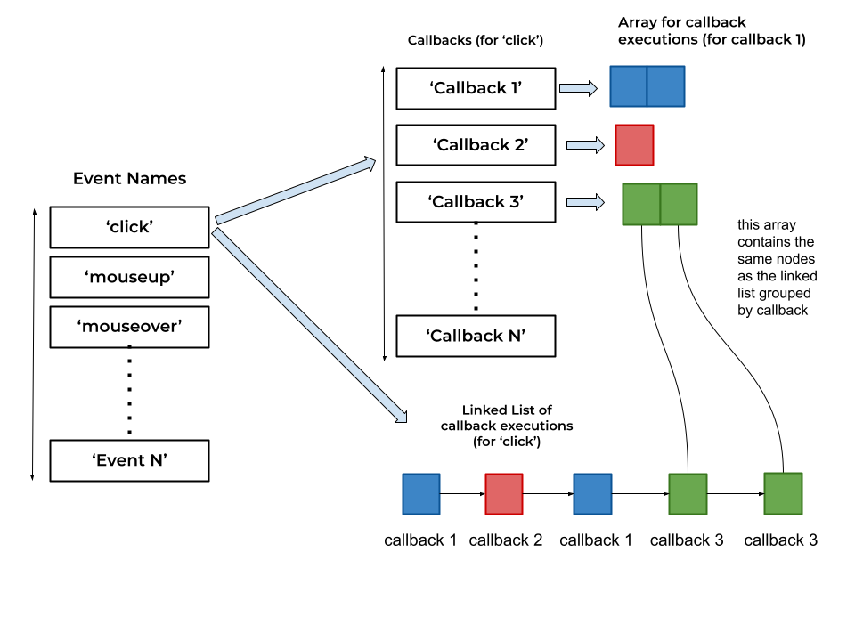

## Event Emitter

A subset of the Node's Event Emitter implementation that provides basic functionality for `on`, `off` and `emit` methods.
The basic API is described [here](https://nodejs.org/api/events.html#events_class_eventemitter).

## How are the events stored?


## tests
Check if the subset of the `NodeEventEmitter` works in the same way as `EventEmitter` with:

```js
npm test
```
